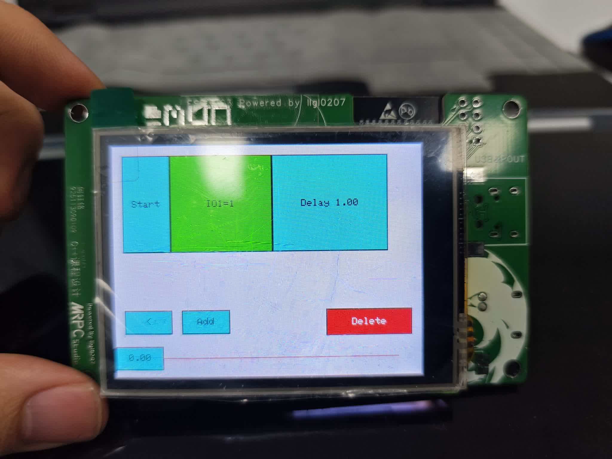
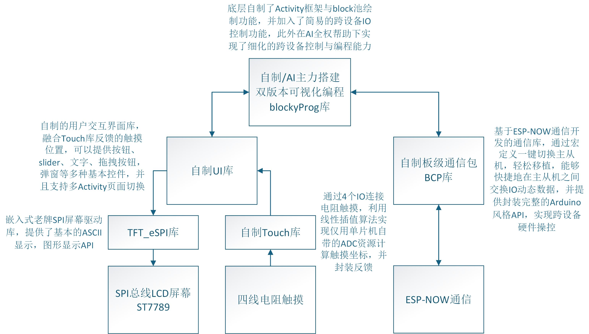
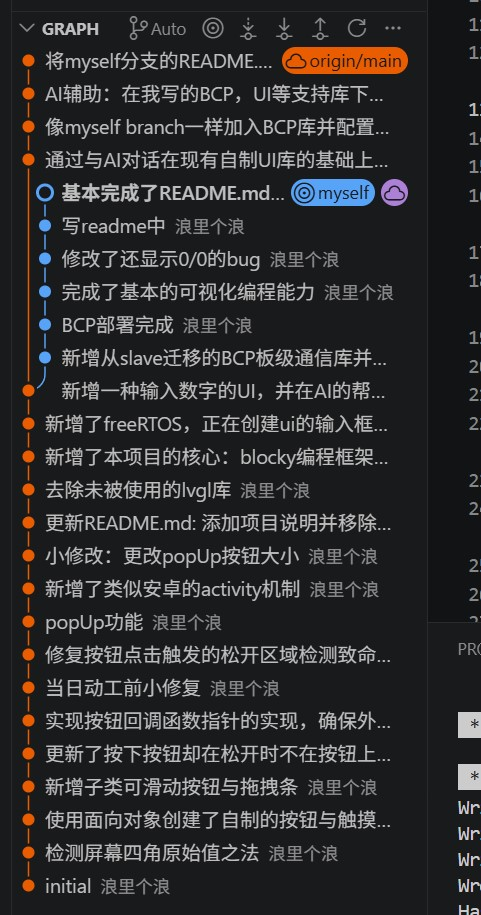

## ⚠️ 重要提示

**您当前访问的是 `main` 分支，该分支的代码中blockyProg库的大部分业务代码完全由AI编写，将不用于课程设计考核。代码文件位于`/src`目录下。**

本课设共包含两个分支：

- **`myself` 分支**：基本手工 coding，搭配AI辅助纠错与自动补全，是**考核主体**。
- **`main` 分支**：因工程周期缘故，其中的 `blockyProg` 库有大部分业务代码由 AI 生成。该分支仅用于验证自制库的通用性与完善性（证明 AI 能够掌握并运用该库），**并非为课程设计考核而设**。

> **再次强调**：`main` 分支下的所有 AI 代码**不计入考核范围**，请评审时勿将其作为评分依据。感谢您的理解。
# 浪里个浪的C++课设文件
这是一个基于esp32嵌入式平台的移动终端，它具有一块LCD屏幕，拥有简易的交互UI，目标是实现可视化编程的积木搭建，并通过esp now远程指挥被控esp32设备。

## 需求分析
### 课题背景<!-- 课题背景、设计思想、拟采用方法 -->
嵌入式平台常用于控制各类硬件设备，如电机、传感器、LED 灯、LCD 屏幕等。这些设备通常需要与电脑等上位机交互，以实现控制。然而在调试场景中，有线方式往往不便，尤其当设备含有活动机构时（例如遥控电机角度或调节 PID 参数）。

ESP32 平台具备射频功能，可方便地通过网络与上位机交互，但依赖传统 WiFi 或蓝牙调试需经历配对过程，且 WiFi 涉及 IP 地址、网段等配置，较为繁琐。那么，是否可以利用 ESP32 自身的通信能力，使其充当上位机，并借助 ESP-NOW 这一极简协议实现无线调试呢？

本课设将基于 ESP32 平台搭建图形交互系统，设计一个可视化编程引擎，实现跨设备控制信息的传递，以验证该方案的可行性。
### 设计思想
让esp32搭载一块具备电阻触摸的LCD屏幕，通过LCD屏幕进行交互，让esp32设备成为上位机，通过绘图API搭建一个简易的交互UI，自建使用esp now协议的通信库进行通信，实现可视化编程，验证无线调试的可行性。
### 拟采用的方法
esp32的开发环境多种多样，有着成熟的生态环境。本次开发使用了Arduino开发环境，通过platformIO IDE 开发ESP32S3平台。屏幕采用了320*240分辨率的ST7789 LCD屏幕，具有4线电阻触摸，使用TFT_eSPI库进行驱动，通信采用esp now协议。

通过自建Touch库，UI库，BCP库分别实现触摸驱动，UI管理与渲染，板间通信。
使用git进行版本控制，追溯开发历史。
采用断点运行调式与串口调试两种方式进行调试，并搭配AI Agent进行辅助。
## 总体设计<!-- 总体功能及模块设计，可用图示 -->
> 提示 *本课设的主要代码位于库根目录下的src目录下*
### 总体功能及模块设计
模块化库设计

### 运用到面向对象思想的主要部分
UI库：由于底层TFT_eSPI主要功能为图形绘制，而无法直接处理可交互动态界面，所以自制了UI库实现了多Activity机制下的界面控件管理与绘制。面向对象思想体现如下：
1. **继承与多态**：定义了基类 `uiElementBase`，所有UI元素（如按钮 `uiButton`、文本 `uiText`、滑块 `uiSlider`）均继承自该基类，并实现了纯虚函数 `draw()`。这使得渲染引擎 `uiRender()` 可以通过基类指针统一调用不同控件的绘制方法，实现了接口的统一和多态性。
2. **封装**：将触摸检测逻辑封装在 `uiButtonBase::touchResponse()` 中，自动处理按下、长按、点击等状态机转换，对外仅暴露回调函数接口，降低了使用复杂度。
3. **组合模式**：`uiActivity` 类作为容器，管理一组 `uiElementBase` 对象，实现了界面的模块化管理和切换。

Blocky编程模块：
1. **抽象基类**：定义 `blockyBase` 基类，包含 `updateFrame()`（更新位置）和 `execute()`（执行逻辑）纯虚函数。
2. **具体实现类**：`blockyStart`、`blockyDigitalWrite`、`blockyAnalogWrite` 继承自 `blockyBase`，分别实现具体的积木块行为和绘制逻辑。
3. **动态管理**：使用 `std::vector<blockyBase*>` 管理积木块池，支持动态添加、删除和遍历执行，体现了对象的生命周期管理。

## 具体实现<!-- 界面设计及具体功能实现 -->
1. **UI交互系统**：
   - 实现了基于 Activity 的页面管理机制，支持主界面、添加积木界面、确认对话框等多页面切换。
   - 开发了自定义控件：包括标准按钮、拖拽按钮、滑块（用于选择IO口和模拟值）、文本标签等。
   - 实现了电阻触摸屏驱动，通过校准参数将模拟电压值转换为屏幕坐标，并计算触摸增量以支持拖拽操作。

2. **可视化编程引擎**：
   - **积木搭建**：用户可通过“Add”按钮进入添加模式，选择数字输出（HIGH/LOW）或模拟输出（0-100%占空比），并选择对应的IO口（IO1, IO2, IO19, IO20）。
   - **积木管理**：支持积木块的横向排列，当积木总长度超过屏幕宽度时，可通过左右箭头或滑块进行视野移动。每个积木块单击可出现删除按钮，点击后弹出确认对话框，防止误删。
   - **程序执行**：点击“Start”积木块，系统按顺序遍历 `blockyPool` 中的积木，依次执行 `execute()` 方法，并通过 ESP-NOW 发送控制指令到从机。

3. **ESP-NOW 通信协议**：
   - **主机模式 (Master)**：负责发起配对、管理从机列表 (`ioMsgPool`)、发送控制指令。通过 MAC 地址识别不同从机。
   - **从机模式 (Slave)**：接收主机握手包建立连接，接收控制指令包并解析，根据指令配置 GPIO 模式（输入/输出）及电平/PWM 值，并定期反馈状态（当前代码主要侧重控制下发）。
   - **数据包结构**：定义了 `ioMsgPack` 结构体，包含 MAC 地址、IO 定义数组、引脚模式数组、读写数据数组等，确保通信的高效性和结构化。

## 系统调试<!-- 遇到的问题和解决办法 -->
对于遇到的问题，最重要的是要保留历史记录。本课设**使用git进行版本控制**，确保了commit有迹可查，方便定位问题所在。

值得一提的是ESP32平台的debug功能真的很鸡肋，因为硬件断点能力弱，debug每走一步都要耗费大量时间，很多情况下不如用串口print调试。
而当遇到复杂的运行时错误时，AI Agent的辅助也是重中之重。

本项目调试采用“现象复现 -> 串口日志/断点定位 -> 最小修复 -> 回归验证”的流程。结合近期提交记录（例如 3984463、7e75016、3859954、62ce5ef），以下问题是对稳定性影响最大的环节。

1. **按钮未创建或显示异常（Blocky 初始按钮问题）**：
   - **现象**：同样是创建按钮，直接 `new uiButton(...)` 可以显示，而通过 `new blockyStart(...)` 时按钮可能不出现或位置异常。
   - **根因A（坐标未初始化）**：构造流程中若 `x` 没有先按 `blockyStartX + getBlockyLength(index)` 明确初始化，按钮坐标可能是随机值，表现为“没创建成功”。
   - **根因B（Activity 创建失败未判空）**：`createActivity` 遇到重名会返回 `nullptr`。若后续仍继续 `new uiButton/new uiText`，控件会写入无效活动上下文，最终表现为不显示或崩溃。
   - **修复**：
     - 在 `blockyStart` 构造函数中显式计算并写入 `x`。
     - 对 `createActivity` 的返回值做判空；若失败立即返回或切换降级逻辑。
     - 通过 `getActivity("blockyProgMain")` 与 `uiRender()` 做一次可见性回归验证。

2. **多文件全局对象初始化顺序风险（Static Initialization Order Fiasco）**：
   - **现象**：启动早期偶发崩溃，或 `getActivity`/`uiRender` 在某些版本下出现空指针访问。
   - **根因**：`UI.cpp` 中的 `uiActivityPool` 与其它编译单元中的全局实例（例如在构造函数里调用 `createActivity` 的对象）之间，初始化顺序在 C++ 标准下不保证。
   - **修复思路**：
     - 避免在全局对象构造函数中依赖跨文件全局容器。
     - 将初始化动作推迟到 `setup()` 或显式 `init()` 阶段。
     - 所有渲染入口先判空：`if(renderActivityPtr == nullptr) return;`。
   - **经验**：嵌入式多文件工程里，“全局对象 + 复杂构造副作用”是高危组合。

3. **弹窗数字乱码/显示错误（字符串生命周期问题）**：
   - **现象**：输入框确认后，弹窗显示的数字不稳定，偶发乱码。
   - **根因**：`popUp(buffer)` 若传入的是函数内局部数组，函数返回后指针悬空，后续绘制访问非法内容。
   - **修复**：使用静态缓冲区并限制写入长度，例如 `static char buffer[48]; snprintf(buffer, sizeof(buffer), ...)`。
   - **补充**：去掉换行符可避免部分绘图 API 对多行字符串处理不一致。

4. **vector 容器管理与删除一致性问题（核心）**：
   - **现象**：删除中间积木后，后续积木行为错位、删除按钮作用到错误对象，甚至越界访问。
   - **根因**：`std::vector<blockyBase*> blockyPool` 在 `erase` 后元素前移，旧 `index` 和 UI 绑定关系失效。
   - **修复**：
     - 删除后统一重排：重新写入每个 block 的 `index`。
     - 立即调用 `updateFrame()` 刷新按钮坐标与删除按钮绑定索引。
     - 删除入口限制：禁止删除 0 号 Start 块，并检查 `index < blockyPool.size()`。

5. **输入页面回收失败（Activity 名称不一致）**：
   - **现象**：输入流程结束后页面残留，后续流程异常。
   - **根因**：创建时使用 `"InputNumber"`，删除时若误写成其它名称，会导致页面对象未被释放。
   - **修复**：统一创建名与删除名，确保 `deleteActivity("InputNumber")` 与创建严格一致。

6. **ESP-NOW 配对与双向链路问题**：
   - **现象**：主机发起配对后，从机无法回传状态，表现为“看似配对成功但数据不更新”。
   - **根因**：从机收到握手后，未把主机 MAC 写入 peer 列表，导致回包失败，且从机回传数据包的mac地址是主机地址，导致主机误将自身地址当作从机地址。
   - **修复**：在从机接收握手包（Type 0x00）后立刻 `esp_now_add_peer`；并统一使用 6 字节二进制 MAC，不使用字符串 MAC。主机识别从机mac使用回调函数给出的mac，而不使用数据包中的mac。
   - **验证**：通过串口日志同时观察发送回调与接收回调，确认握手与状态回传都成功。

7. **触摸漂移与按键误触**：
   - **现象**：点击边缘不准、按下后移出按钮区域时触发逻辑混乱。
   - **根因**：电阻屏线性映射参数与按压状态机共同影响命中判定。
   - **修复**：
     - 在按钮状态机中分离 `nowPressed/nowInTheBtn` 与 `lastPressed/lastInTheBtn`，保证“按下-长按-松开”语义一致。

8. **UI 刷新闪烁与性能抖动**：
   - **现象**：高频操作下出现闪屏，拖动时帧率下降。
   - **根因**：TFT_eSPI 缺少完整双缓冲，全屏重绘成本高。
   - **修复**：引入 `lowRender()` 进行限频渲染，仅在关键状态切换时触发全量 `uiRender()`。
   - **后续方向**：基于 dirty region 的局部重绘，进一步降低满屏 fill 的频次。

### 多文件编程规范沉淀（extern、声明/定义、头文件守卫）

1. **声明与定义的边界**：
   - 头文件只放“声明”（函数原型、`extern` 变量、类型定义）。
   - 源文件只放“定义”（变量实体、函数实现）。
   - 例如：`UI.h` 中 `extern std::vector<uiActivity*> uiActivityPool;`，对应实体只在 `UI.cpp` 定义一次。

2. **extern 的正确使用**：
   - `extern` 的意义是“告诉编译器该符号在别处定义”，不是创建变量。
   - 若在多个 `.cpp` 重复定义同名全局变量，会出现链接错误（multiple definition）。
   - 若只声明不定义，则会出现未定义引用（undefined reference）。

3. **头文件守卫必须统一**：
   - 本工程使用 `#ifndef/#define/#endif` 形式（如 `UI_H`、`TOUCH_H`、`BCP_H`、`BLOCKYPROG_H`）。
   - 作用：防止重复包含导致重定义和编译时间膨胀。
   - 约束：一个头文件只应有一组守卫宏，命名保持唯一且稳定。

4. **避免在头文件放可变全局实体**：
   - 头文件内若直接定义可变全局对象，会在每个包含该头的编译单元各生成一份，极易触发链接问题。
   - 常量若必须放头文件，优先 `constexpr` 或 `inline` 变量（在 C++17 及以上），并评估平台编译选项。

5. **vector 管理建议（嵌入式场景）**：
   - 删除元素后立即重建索引关系，不要信任旧下标。
   - 对指针型 vector，明确所有权：创建点、释放点、容器脱链顺序必须一致。
   - 迭代中删除元素要格外谨慎，优先“先定位，再删除，再回收/重排”的三段式。

## 结果分析<!-- 系统优缺点以及改进 -->
### 优点
1. **无线调试便捷**：摆脱了有线连接的限制，利用 ESP-NOW 低延迟特性，实现了快速的远程控制和参数调整。
2. **可视化交互直观**：通过积木式编程界面，降低了嵌入式开发门槛，无需编写代码即可构建简单的控制逻辑。
3. **模块化设计良好**：UI 库、通信库、业务逻辑分离，代码耦合度低，便于后续功能扩展和维护。

### 缺点
1. **功能单一**：目前仅支持数字输出和模拟输出，缺乏输入模块（如读取传感器数据）、逻辑控制模块（如循环、判断）和延时模块。（这一点可以通过AI辅助编写实现，详情参考main分支，该分支基于自制的UI,BCP,Touch库使用AI编程生成了带有逻辑控制的积木块，更能更为细化）
2. **UI 性能瓶颈**：在积木数量较多时，滑动和刷新帧率下降，缺乏双缓冲机制优化。
3. **通信可靠性**：ESP-NOW 为无连接协议，缺乏 ACK 重传机制，在网络干扰较强时可能出现指令丢失，类似UDP。不过由于发包频率足够高，重传并不是很必要。

### 改进方向
1. **丰富积木类型**：增加延时、条件判断、循环、传感器读取等积木，提升编程灵活性。
2. **优化渲染性能**：引入局部刷新机制，仅重绘发生变化的区域，而非全屏刷新。
3. **增强通信稳定性**：应用层增加简易的 ACK 确认机制，确保关键控制指令到达。
4. **保存与加载**：支持将积木序列保存到 SPIFFS/LittleFS，实现程序的持久化存储。
5. **工程规范自动检查**：增加编译期检查（警告级别、静态分析）和最小回归测试，重点覆盖 Activity 生命周期、blockyPool 删除重排、ESP-NOW 配对回包三个高风险路径。
## 课程总结<!-- 心得与体会 -->
### 关于AI辅助
首先我需要声明的是，本课设的myself分支下的代码基本手写（使用了自动补全），没有照搬AI或者使用agent做CV工程师，main分支下blockyProg库的业务部分代码则大部分基于AI的agent自动生成。

但是需要提出的是，在本次课设的完成中，AI的辅助起到了至关重要的作用，在此我有必要特地开一个副标题着重介绍。当下大模型的编程能力指数上涨，使得AI的辅助成为不可缺少的利器。不论是真正运用到工程实践或竞赛中（比如电赛，RoboMaster等比赛），还是用于辅助学业，使用AI编程、差错、甚至直接用于教学的能力不容小觑。老师在课设的介绍课上提到不反对使用AI，我深有感悟。

虽然在课程设计这门课上主要需要体现的是学生自主的编程能力与对C++的掌握能力，但是要想运用到实际当中，不仅要有扎实的基本功，更要有高效的生产力。我观察到身边的很多同学在使用AI进行辅助编程的过程中，还在使用网页端大语言模型的对话窗口，靠手动的复制粘贴与询问报错来实现AI的辅助，不可否认的是他们确实体验到了AI的便利。不过相比之下，我发现使用更成熟的Agent以及专为coding优化的模型可以进一步提升效率，这也是我在此次课设中的尝试。

其实肉眼可见的是这篇课程设计报告也运用了AI辅助，我基于自己的调试记录和Git commit历史，借助AI辅助整理并润色了系统调试章节，尤其是优化我的语言表达以及markdown格式展示。

在课设过程中，有关AI的上述感悟，我认为是课程总结的最大收获。
### 关于重复造轮子
课程设计中，我多次重复造轮子，不论是UI库，触摸库还是BCP库。对于UI和Touch库，其实我完全可以用现有的，成熟的LVGL库替代它们，但是我觉得花时间重构一个底层的轮子实现，会比写一堆业务代码学到的东西多而有趣，所以才选择了做这么一件事情。而对于BCP库，我个人认为这种小众的IO跨设备控制需求比较独特，自己写一个简洁的BCP板级通信库则是一件值得的事情。而且在本次课设中我第一次大量接触了多文件编程与库的编写，当把一个库跨工程移植到其他的地方并且顺利地过编，运行，我个人认为是一件很浪漫的事情。
### 关于工程经验
使用git进行版本控制是一个好的工程实践，这不仅有利于回溯历史，查询记录，更有利于记录工作流，以及提高团队合作效率（虽然本次课设不是团队完成）。
通过本次课程设计，我深入理解了嵌入式系统的全栈开发流程，从底层的 GPIO 控制、触摸驱动，到中层的通信协议封装，再到上层的 UI 交互和业务逻辑实现。当然，最重要的是C++的工程掌握能力。
1. **面向对象思维的实践**：在 C++ 中运用继承、多态和封装，极大地简化了 UI 控件的管理和扩展，让我体会到良好架构设计的重要性。
2. **通信协议的理解**：通过手动封装 ESP-NOW 数据包，加深了对无线网络通信、字节序、内存对齐等底层概念的理解。
3. **问题解决能力**：在调试触摸不准、通信失败等问题过程中，学会了使用串口日志、分段排查等方法定位 Bug，提升了工程实践能力。
4. **多文件协作规范意识提升**：在本次迭代中，进一步理解了 `extern`、声明/定义分离、头文件守卫、vector 生命周期管理等基础规范对稳定性的决定性作用。

### 关于未来
本项目虽已实现基本功能，但在用户体验和功能丰富度上仍有很大提升空间。未来希望能引入更强大的图形库（如 LVGL）和更完善的脚本引擎，将其打造为一个通用的物联网调试终端。